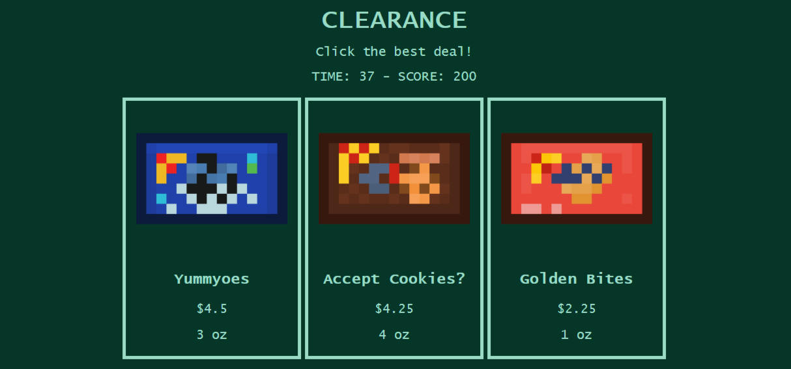

# Clearance

Clearance is a fast paced shopping game where you have to quickly solve for unit price.

[Play on Homepage](https://greybeard42.github.io/javascript/clearance/)

This repository does not contain the game images. If you want to see them, click here: [Pixilart Page](https://www.pixilart.com/art/junk-food-sr25b458ee52daws3?ft=user&ft_id=1842230)

My high score: 1750

# Changelog

v1 - July 26, 2024

- 5 Product Types (~5 items each)

- Fullscreen Button

- HTML Animations (spin + marquee)

- Play Again Button

- 50 Second Timer

- Every 3 levels there's a chaos round with x2 options
